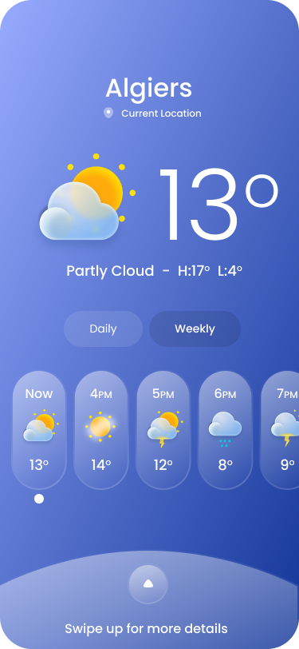

# Clima App: A Flutter App for Weather Forecasting

**Clima App** is a clean and intuitive mobile application built using Flutter to deliver accurate weather information. It allows users to view the current weather, future forecasts, and more, all in a beautiful and responsive design.

## Features

* **Current Weather:** Get real-time weather updates for your current location or any searched city.
* **Weather Forecast:** View weather forecasts for the upcoming days.
* **Location-based Weather:** Automatically fetch weather data based on your current location.
* **Search by City:** Search for weather updates by entering any city name.
* **Weather Details:** View additional weather data like temperature, humidity, wind speed, etc.
* **User-friendly UI:** Enjoy a clean, minimalistic design with responsive layouts.
* **Animations:** Beautiful weather animations to represent different weather conditions.

## Technologies

* **Flutter:** Google's UI toolkit for building natively compiled applications for mobile, web, and desktop from a single codebase.
* **Dart:** Programming language optimized for building cross-platform apps with Flutter.
* **API Integration:** Fetch weather data from [Weather API] for real-time updates.
* **[Other technologies used, e.g., Firebase, REST API, etc.]**

## Screenshots

| Home Screen       | 
| ----------------- | 
|  |

## Getting Started

### Prerequisites
* Flutter SDK (version 3.0 or higher)
* Dart SDK (version 2.0 or higher)
* A code editor like VSCode or Android Studio

### Installation


1. Clone the repository:
   ```bash
   git clone [the repo url]
2. Navigate to the project directory:
   ```bash
   cd clima_app
3. Install dependencies:
   ```bash
   flutter pub get
4. Run the app on an emulator or physical device::
   ```bash
   flutter run

### Contributing
We welcome contributions to AL24News! Please refer to our contribution guidelines for details.

### License
This project is licensed under the raufzer license.
